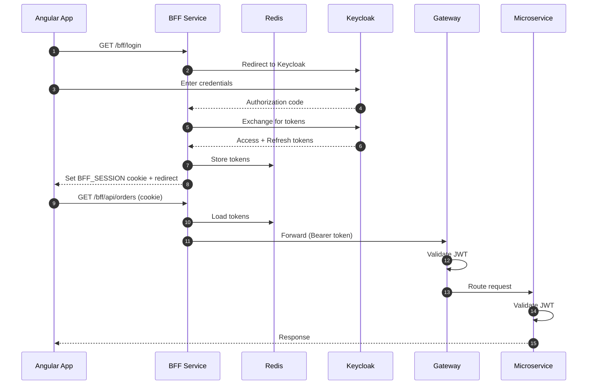
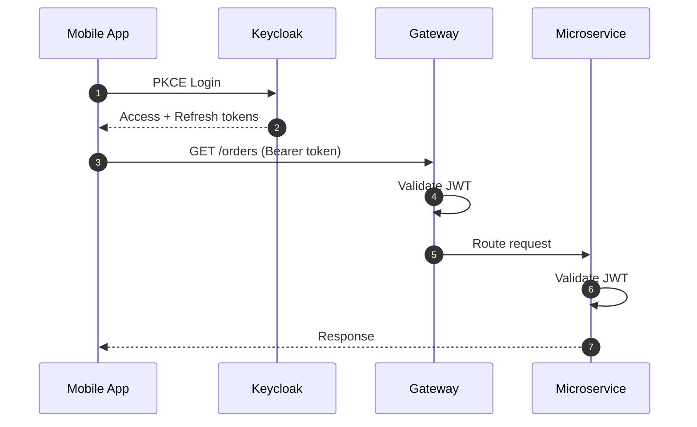
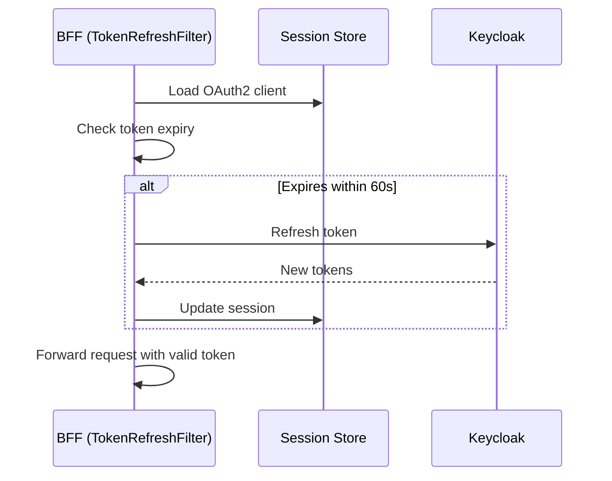

# Enterprise Spring Microservices Template

A production-ready secure microservices template using **Spring Boot 4.x**, **Keycloak**, and **Angular 22**. Designed to support both Web (BFF pattern) and Mobile (direct JWT) applications with enterprise-grade security.

---

## Table of Contents

- [Features](#features)
- [Architecture](#architecture)
- [Quick Start](#quick-start)
- [Run everything in Docker](#run-everything-in-docker)
- [Project Structure](#project-structure)
- [Services](#services)
- [Security Patterns](#security-patterns)
- [API Reference](#api-reference)
- [Development](#development)
- [Documentation](#documentation)

---

## Features

- **Two-Lane Architecture** - Separate flows for Web (cookie-based) and Mobile (token-based) clients
- **BFF Pattern** - Backend-for-Frontend isolates OAuth2 complexity from the browser
- **Defense in Depth** - JWT validated at both Gateway and each microservice (Zero Trust)
- **Proactive Token Refresh** - 60-second buffer prevents mid-flight token expiration
- **Single Sign-Out (SLO)** - Complete logout across BFF sessions and Keycloak IdP
- **Rate Limiting** - Redis-backed token bucket algorithm at the Gateway
- **Circuit Breaker** - Resilience4j at Gateway and BFF for graceful failure handling
- **Distributed Tracing** - Micrometer Tracing with Zipkin for end-to-end request visibility
- **Centralized Logging** - Structured JSON logs with Loki aggregation and Grafana visualization
- **Prometheus Metrics** - JVM, HTTP, and circuit breaker metrics with Grafana dashboards
- **Robust API Error Handling** - Jakarta Validation on DTOs with standardized [RFC 9457 (formerly 7807) Problem Details](https://datatracker.ietf.org/doc/html/rfc9457) responses.
- **OpenAPI Documentation** - Swagger UI with Gateway aggregation
- **Angular 22 UI** - Modern standalone components with Angular Material
- **Keycloak Integration** - Enterprise identity provider with user management
- **Testcontainers** - Reliable integration testing with ephemeral databases

---

## Architecture

```
┌─────────────────────────────────────────────────────────────────────────────┐
│                              CLIENTS                                        │
├─────────────────────────────────┬───────────────────────────────────────────┤
│         Web Browser             │            Mobile App                     │
│      (Angular @ 4200)           │         (Flutter/Native)                  │
└────────────┬────────────────────┴───────────────────┬───────────────────────┘
             │ Cookie (BFF_SESSION)                   │ Bearer Token
             ▼                                        │
┌────────────────────────┐                            │
│   BFF Service (8081)   │                            │
│  ├─ OAuth2 Client      │                            │
│  ├─ Session (Redis)    │                            │
│  └─ Token Refresh      │                            │
└────────────┬───────────┘                            │
             │ Bearer Token                           │
             ▼                                        ▼
┌─────────────────────────────────────────────────────────────────────────────┐
│                        API Gateway (8888)                                   │
│                    JWT Validation (Defense Layer 1)                         │
└─────────┬─────────────────────┬─────────────────────┬───────────────────────┘
          │                     │                     │
          ▼                     ▼                     ▼
┌──────────────────┐   ┌──────────────────┐   ┌─────────────────┐
│ Profile Service  │   │  Order Service   │   │ Keycloak Admin  │
│     (8082)       │   │     (8083)       │   │    Service      │
│  JWT Validation  │   │  JWT Validation  │   │     (8084)      │
│ (Defense Layer 2)│   │ (Defense Layer 2)│   │                 │
└────────┬─────────┘   └────────┬─────────┘   └────────┬────────┘
         │                      │                      │
         ▼                      ▼                      ▼
┌─────────────────┐    ┌─────────────────┐    ┌─────────────────┐
│   PostgreSQL    │    │   PostgreSQL    │    │    Keycloak     │
│     (5433)      │    │     (5433)      │    │     (8080)      │
└─────────────────┘    └─────────────────┘    └─────────────────┘
```

---

## Quick Start

### Prerequisites

- Docker & Docker Compose
- Java 25
- Node.js 24+ (for Angular UI, Angular 22)
- Maven (or just use the bundled `./mvnw` wrapper - no local Maven install needed)
- [Playwright](https://playwright.dev/) browsers, only needed for the Angular E2E suite - run
  `npx playwright install chromium` once inside `angular-ui/` (see
  [Frontend tests](#frontend-tests))

### 1. Start Backend Services

```bash
./manage_services.sh start
```

This starts:
- Keycloak (http://localhost:8080)
- Zipkin (http://localhost:9411)
- Loki (http://localhost:3100)
- Grafana (http://localhost:3000)
- PostgreSQL databases
- Redis
- All Spring Boot services

### 2. Keycloak is Pre-Configured

The realm import (`keycloak/realm-config/realm-export.json`) already grants
`admin-service-client`'s service account the `realm-management` client roles
(`manage-users`, `view-users`) it needs to manage users - no manual setup required.

To verify: log in to [http://localhost:8080/admin](http://localhost:8080/admin) (`admin` / `admin`),
select **my-realm**, then **Clients** → **admin-service-client** → **Service Account Roles** and
confirm **manage-users** and **view-users** are listed.

### 3. Start Angular UI

```bash
cd angular-ui
npm install
npm start
```

### 4. Access the Application

| URL                                                 | Description                  |
|-----------------------------------------------------|------------------------------|
| http://localhost:4200                               | Angular Web UI               |
| http://localhost:8080/admin                         | Keycloak Admin Console       |
| http://localhost:8888/webjars/swagger-ui/index.html | API Documentation            |
| http://localhost:9411                               | Zipkin (Distributed Tracing) |
| http://localhost:9090                               | Prometheus (Metrics)         |
| http://localhost:3000                               | Grafana (Dashboards)         |

### 5. Login

- **Username:** `user`
- **Password:** `password`

---

## Run everything in Docker

Steps 1-3 above run infra in Docker and the Java/Angular apps on the host. To run the
**entire stack** (infra + all 5 Java services + Angular UI) in Docker instead:

1. Keycloak has no fixed hostname (`KC_HOSTNAME` is intentionally unset), so it's reachable
   as `keycloak:8080` from other containers *and* the browser needs to resolve that same
   name. Add this line to `/etc/hosts` once:

   ```
   127.0.0.1 keycloak
   ```

2. Build and start everything:

   ```bash
   docker compose --profile apps up -d --build
   ```

   This builds the 5 Java services from the root `Dockerfile` (one multi-stage Dockerfile,
   selected per service with `--build-arg MODULE=<service-dir>`) and the Angular UI from
   `angular-ui/Dockerfile`, then starts them alongside the infra containers on the same
   `sec-network`.

3. Same ports as the host-run setup, plus each service's management (actuator) port:

   | Service                | App port | Management port |
   |-------------------------|----------|------------------|
   | Angular UI              | 4200     | -                |
   | BFF                     | 8081     | 9081             |
   | Gateway                 | 8888     | 9888             |
   | Profile Service         | 8082     | 9082             |
   | Order Service            | 8083     | 9083             |
   | Keycloak Admin Service   | 8084     | 9084             |

4. Stop everything (infra + apps):

   ```bash
   docker compose --profile apps down
   ```

To go back to infra-only mode, `docker compose up -d` (no `--profile apps`) starts just
Keycloak, the databases, Redis and the observability stack, same as before.

---

## Project Structure

```
root_folder/
├── angular-ui/                 # Angular 22 Web Application
│   ├── src/app/
│   │   ├── core/               # Auth service, interceptors, guards
│   │   ├── features/           # Login, Dashboard, Profile, Orders
│   │   └── shared/             # Main layout with sidenav
│   ├── proxy.conf.json         # Dev proxy to BFF
│   ├── Dockerfile              # Build + nginx runtime image
│   └── nginx.conf              # SPA fallback + /bff/ reverse proxy
├── bff/                        # Backend-for-Frontend Service
├── gateway/                    # Spring Cloud Gateway
├── profile-service/            # User Profile Microservice
├── order-service/              # Order Management Microservice
├── keycloak-admin-service/     # Keycloak User Management Proxy
├── common-core/                # Shared constants and utilities (Zero dependencies)
├── common-web/                 # Shared web components (Exception handling)
├── common-security/            # Shared security config (Resource Server setup)
├── dependencies-bom/           # Dependency version management
├── docker/                     # Prometheus/Grafana provisioning config
├── docs/                       # Architecture documentation
├── Dockerfile                  # Shared multi-stage build for all 5 Java services
├── compose.yaml                # Infra (default) + apps (--profile apps) stack
├── mvnw / mvnw.cmd              # Maven wrapper - no local Maven install needed
└── manage_services.sh          # Service management script
```

### Shared Libraries

| Module            | Purpose         | Key Components                                               |
|-------------------|-----------------|--------------------------------------------------------------|
| `common-core`     | Constants       | `SecurityConstants`, `SessionConstants`                      |
| `common-web`      | Web utilities   | `GlobalExceptionHandler`, `TrailingSlashFilter`, Tracing     |
| `common-security` | Security config | `KeycloakJwtAuthenticationConverter`, `OpenApiConfigFactory` |

#### Dependency Inheritance

```
common-core (zero dependencies)
    │
    ├── Used by: common-web
    │
    └── common-web (+ Spring Web, Validation, Tracing)
            │
            ├── Used by: BFF, common-security
            │
            └── common-security (+ Spring Security, SpringDoc)
                    │
                    └── Used by: Profile Service, Order Service, Keycloak Admin
```

> **Note:** Gateway shares the parent POM but doesn't use the common-* shared libraries, since those are servlet-based and the Gateway runs on WebFlux.

---

## Services

| Service             | Port | Management Port | Technology                     | Purpose                                    |
|---------------------|------|------------------|--------------------------------|--------------------------------------------|
| **Angular UI**      | 4200 | -                | Angular 22, Material           | Web application                            |
| **BFF**             | 8081 | 9081             | Spring Boot 4.x (MVC)          | OAuth2 client, session management          |
| **Gateway**         | 8888 | 9888             | Spring Cloud Gateway (WebFlux) | API routing, JWT validation, rate limiting |
| **Profile Service** | 8082 | 9082             | Spring Boot 4.x                | User profile CRUD                          |
| **Order Service**   | 8083 | 9083             | Spring Boot 4.x                | Order management                           |
| **Keycloak Admin**  | 8084 | 9084             | Spring Boot 4.x                | User provisioning proxy                    |
| **Keycloak**        | 8080 | -                | Keycloak 26.x                  | Identity Provider                          |
| **PostgreSQL**      | 5433 | -                | PostgreSQL 18                  | Application data (profile)                 |
| **PostgreSQL**      | 5434 | -                | PostgreSQL 18                  | Application data (order)                   |
| **PostgreSQL**      | 5432 | -                | PostgreSQL 18                  | Keycloak data                              |
| **Redis**           | 6379 | -                | Redis 8                        | BFF session storage, rate limiting         |
| **Zipkin**          | 9411 | -                | Zipkin 3                       | Distributed tracing UI                     |
| **Prometheus**      | 9090 | -                | Prometheus 3.14                | Metrics collection                         |
| **Loki**            | 3100 | -                | Loki 3.7                       | Log aggregation                            |
| **Grafana**         | 3000 | -                | Grafana 13.2                   | Metrics & logs visualization               |

Actuator (health, metrics, prometheus) is served on each service's management port, not its
public port - see `MANAGEMENT_PORT` in `.env.example`.

> **Note on Gateway Stack:** The API Gateway runs on **Spring Cloud Gateway Server WebFlux** (Spring Boot 4.x) while the other services use MVC. It was originally chosen for the built-in **Redis `RequestRateLimiter`**, which relies on the Reactive stack. Spring Cloud Gateway Server MVC now offers an equivalent distributed `RateLimiter` filter (Bucket4j with a Redis-backed `ProxyManager`), so migrating the Gateway to the servlet stack is a possible future consolidation rather than a blocker.

---

## Observability

The project includes a complete observability stack for distributed tracing, centralized logging, and metrics collection.

### Components

| Tool           | Purpose                                                               | URL                   |
|----------------|-----------------------------------------------------------------------|-----------------------|
| **Zipkin**     | Distributed tracing - view request flows across services              | http://localhost:9411 |
| **Prometheus** | Metrics collection - scrapes `/actuator/prometheus` from all services | http://localhost:9090 |
| **Loki**       | Log aggregation - collects structured logs from all services          | http://localhost:3100 |
| **Grafana**    | Visualization - dashboards for metrics, logs, and traces              | http://localhost:3000 |

### Logging Profiles

All services support three logging profiles:

```bash
# Default: Console output with trace correlation
./manage_services.sh start

# JSON: Structured JSON logs (for production/log shippers)
SPRING_PROFILES_ACTIVE=json ./manage_services.sh start

# Loki: Push logs directly to Loki
SPRING_PROFILES_ACTIVE=loki ./manage_services.sh start
```

Log format includes trace correlation: `[traceId, spanId]` for linking logs to distributed traces.

### Grafana Dashboards

Pre-provisioned **Spring Boot Services** dashboard includes:
- HTTP request rate and response times (p95, p99)
- JVM heap memory and thread counts
- Circuit breaker state and failure rates
- CPU usage and service uptime

**Credentials:** admin / admin

### Trace Propagation

TraceId flows through the entire request chain:
```
Browser → BFF → Gateway → Microservice
         [same traceId propagated via headers]
```

View in Zipkin to see timing breakdown across services.

---

## Security Patterns

Every resource server (Gateway, profile-service, order-service, keycloak-admin-service)
requires the `aud=template-api` claim on every token it accepts, so a token minted for an
unrelated client is rejected even if it's otherwise valid; and the internal user-registration
call from profile-service to keycloak-admin-service is itself authenticated with an
`internal-client` client-credentials token carrying the `INTERNAL_SERVICE` realm role, not
left open behind the Gateway's block route alone.

### Web Application Flow (BFF Pattern)



### Mobile Application Flow



### Proactive Token Refresh

The BFF checks token expiration before each request. If the token expires within 60 seconds, it proactively refreshes to prevent mid-flight expiration.



---

## Frontend Integration & Session Management

### Dual Session Strategy
The BFF maintains two distinct sessions for the Web Client:
1.  **Spring Security Session (`JSESSIONID`)**: Used only for the `/bff/user` endpoint to return OIDC identity claims (email, name).
2.  **BFF Custom Session (`BFF_SESSION`)**: A signed JWT cookie used for all `/bff/api/**` proxy requests. This maps to the actual Access Tokens stored in Redis.

**Why?** This separation allows the proxy logic to be stateless and robust (handling token refresh manually) while leveraging standard Spring Security for the initial OAuth2 login flow.

### AJAX Request Handling (401 vs Redirect)
By default, Spring Security redirects unauthenticated requests to the login page. This breaks AJAX calls in Single Page Applications (SPAs).

**Requirement:** The Angular application **MUST** send the following header with every HTTP request:
```http
X-Requested-With: XMLHttpRequest
```

**Behavior:**
*   **Browser Navigation:** Redirects to Keycloak Login.
*   **AJAX (with Header):** Returns `401 Unauthorized`. The Angular `AuthInterceptor` detects this and redirects the user to login programmatically.

### CSRF Protection
The BFF enables CSRF protection in **all** profiles using Spring Security's SPA recipe: every response carries a readable `XSRF-TOKEN` cookie, and every state-changing request (`POST`, `PUT`, `PATCH`, `DELETE`) to a cookie-authenticated endpoint must echo it back in the `X-XSRF-TOKEN` header, otherwise the BFF answers `403`.

*   Angular's `HttpClient` does this automatically for relative URLs (`/bff/...`), so no frontend code is needed.
*   Public endpoints (`/bff/public/**`) are exempt: they carry no session cookie, so there is nothing to forge.
*   Other HTTP clients (tests, curl) must first `GET` any BFF endpoint to receive the cookie, then send both the cookie and the header.

### Single Sign-Out (SLO)
A single `POST` to `/bff/logout` performs a comprehensive sign-out across all layers (it is a
state-changing request, so - unlike a plain link - it requires the CSRF token like any other
`POST`; see CSRF Protection above and `AuthService.logout()` in Angular for how it submits one via
a hidden form):
1.  **Local & Session Cleanup:** Deletes the Redis session, invalidates the `JSESSIONID`, and clears both `BFF_SESSION` and `JSESSIONID` cookies.
2.  **Identity Provider Logout:** Automatically redirects the browser to Keycloak's logout endpoint to terminate the SSO session, ensuring the user is fully logged out of the IdP.

### URL Transformation Journey

Requests pass through multiple layers, each transforming the URL:

**Example: Get User Profile (Authenticated)**
```
Angular UI
    │ GET /bff/api/profile
    ▼
BFF (8081)
    │ Validates BFF_SESSION cookie
    │ Loads OAuth tokens from Redis
    │ Transforms: /bff/api/profile → /profile
    │ Adds: Authorization: Bearer <token>
    ▼
Gateway (8888)
    │ Validates JWT
    │ Applies: StripPrefix=1, PrefixPath=/api
    │ Transforms: /profile → /api/profile
    ▼
Profile Service (8082)
    │ Validates JWT (defense in depth)
    │ Handles: /api/profile
    ▼
Response flows back through each layer
```

**Example: Public Registration (Unauthenticated)**
```
Angular UI
    │ POST /bff/public/profile/register
    ▼
BFF (8081)
    │ No auth required (public endpoint)
    │ Transforms: /bff/public/profile/register → /profile/public/register
    ▼
Gateway (8888)
    │ No JWT required (matches /*/public/**)
    │ Applies: StripPrefix=1, PrefixPath=/api
    │ Transforms: /profile/public/register → /api/public/register
    ▼
Profile Service (8082)
    │ Handles: /api/public/register (permitAll)
    ▼
Response flows back
```

**Summary Table:**

| Layer   | Input                          | Output                     | Transformation                     |
|---------|--------------------------------|----------------------------|------------------------------------|
| BFF     | `/bff/api/profile`             | `/profile`                 | Strip `/bff/api`, use service name |
| BFF     | `/bff/public/profile/register` | `/profile/public/register` | Strip `/bff`, reorder path         |
| Gateway | `/profile`                     | `/api/profile`             | StripPrefix=1, PrefixPath=/api     |
| Gateway | `/profile/public/register`     | `/api/public/register`     | StripPrefix=1, PrefixPath=/api     |

---

## API Reference

### Web Endpoints (via BFF)

| Method | Endpoint           | Description              |
|--------|--------------------|--------------------------|
| GET    | `/bff/login`       | Initiate OAuth2 login    |
| POST   | `/bff/logout`      | Logout and clear session (CSRF-protected, like any other state-changing request) |
| GET    | `/bff/user`        | Get current user info    |
| GET    | `/bff/api/profile` | Get user profile         |
| POST   | `/bff/api/profile` | Create user profile      |
| DELETE | `/bff/api/profile` | Delete user profile      |
| GET    | `/bff/api/orders`  | List orders              |
| POST   | `/bff/api/orders`  | Create order             |

### Public Endpoints (no authentication)

| Method | Endpoint                                | Description                |
|--------|-----------------------------------------|----------------------------|
| POST   | `/bff/public/profile/register`          | Register new user (email + profile fields only, no username/password; always returns 201 with the same generic message - see [User Registration](docs/user_registration_flow.md)) |
| GET    | `/bff/public/profile/confirm?token=xxx` | Confirm email registration |

Note: Public endpoints follow the pattern `/bff/public/{service}/{path}` which maps to `/{service}/public/{path}` at the gateway, then to `/api/public/{path}` at the service (simplified routing strips the service name).

### Mobile Endpoints (via Gateway)

`bff-client` is a confidential, browser-only client (`directAccessGrantsEnabled=false`); it
cannot do a password grant. For quick curl testing, use `test-client`, a confidential client
dedicated to integration tests and manual API calls:

```bash
# Get access token (test-client - integration tests/curl only)
curl -X POST http://localhost:8080/realms/my-realm/protocol/openid-connect/token \
  -d "client_id=test-client" \
  -d "client_secret=test-secret" \
  -d "grant_type=password" \
  -d "username=user" \
  -d "password=password"

# Call API
curl -H "Authorization: Bearer <TOKEN>" http://localhost:8888/profile
```

Real mobile apps should instead use the public `mobile-client` with the authorization code
flow + PKCE (`S256`) - it has no client secret and never performs a password grant.

### Error Responses (RFC 9457, formerly RFC 7807)

All API errors return standardized [Problem Details](https://datatracker.ietf.org/doc/html/rfc9457) format:

```json
{
  "type": "about:blank",
  "title": "Input Validation Error",
  "status": 400,
  "detail": "Validation Failed",
  "errors": {
    "email": "Invalid email format",
    "age": "Age must be a positive number"
  }
}
```

| Status | Title                  | When                                              |
|--------|------------------------|---------------------------------------------------|
| 400    | Input Validation Error | Request body fails DTO validation                 |
| 401    | Unauthorized           | Missing or invalid JWT                            |
| 403    | Forbidden              | Authenticated but lacks the required role/authority |
| 404    | Not Found              | Resource doesn't exist                            |
| 405    | Method Not Allowed     | HTTP method not supported for the endpoint        |
| 409    | Conflict               | Resource already exists (e.g., duplicate profile) |
| 500    | Internal Server Error  | Unexpected server error (sanitized in production) |

---

## Development

### Commands

```bash
./manage_services.sh start     # Start all services (infra in Docker, apps on the host)
./manage_services.sh stop      # Stop all services
./manage_services.sh restart   # Restart services
./manage_services.sh test      # Run tests
```

Or build/test the Java services directly with the bundled Maven wrapper (no local Maven
install required):

```bash
./mvnw -DskipTests package     # Build all services
./mvnw test                    # Run all tests (needs Docker only)
```

Integration tests are self-contained: the `common-test` module starts Keycloak (with the realm
import from `keycloak/realm-config`), Redis and PostgreSQL as Testcontainers, so no running
stack is needed. Each module's suite adds roughly 15 seconds for the Keycloak container.

See [Run everything in Docker](#run-everything-in-docker) to run the whole stack, apps
included, in containers instead.

### Database Migrations

`profile-service` and `order-service` manage their schema with Flyway
(`src/main/resources/db/migration/V*.sql`); Hibernate only validates it
(`spring.jpa.hibernate.ddl-auto=validate`). Add a new `V<n>__<name>.sql` file for every schema
change. Existing databases created by the old `ddl-auto=update` setup are baselined at version 1
on first start (`spring.flyway.baseline-on-migrate=true`).

### CI and Dependency Updates

`.gitlab-ci.yml` builds the Java services and the Angular app (with its unit tests), runs the
Java tests with Testcontainers via Docker-in-Docker, offers a manual Playwright E2E job and, on
`main` and tags, builds the Docker images. `renovate.json` keeps Maven, npm, Docker image and CI image versions up to date.

### Angular Development

```bash
cd angular-ui
npm start                      # Start dev server with proxy
npm run build                  # Production build
npm test                       # Run tests
```

### Frontend tests

`angular-ui` has two separate test suites:

- **Unit tests** (`npm test`, from `angular-ui/`) run the component/service specs with Vitest
  (via `@angular/build:unit-test`), headless and non-interactively - safe to call from CI as-is.
  They mock the backend with `provideHttpClientTesting()`, so nothing else needs to be running.
- **End-to-end tests** (`npm run e2e`, from `angular-ui/`) run with Playwright against a real,
  already-running stack. Before calling it, the following must be up:
  - Angular dev server on http://localhost:4200 (`npm start`)
  - BFF on http://localhost:8081, Gateway, Keycloak (`my-realm`) and the profile/order services
  - The Playwright browser itself: run `npx playwright install chromium` once

  `E2E_BASE_URL` overrides the app URL (defaults to `http://localhost:4200`), and
  `E2E_KEYCLOAK_USER` / `E2E_KEYCLOAK_PASSWORD` override the Keycloak test credentials (default
  to the `user` / `password` test account).

### Tech Stack

| Layer         | Technology                                           |
|---------------|------------------------------------------------------|
| Frontend      | Angular 22, Angular Material, RxJS, Signals          |
| BFF           | Spring Boot 4.x (MVC), Spring Security OAuth2 Client |
| Gateway       | Spring Cloud Gateway WebFlux (Spring Boot 4.x)       |
| Services      | Spring Boot 4.x (MVC), Spring Data JPA               |
| Identity      | Keycloak 26.x                                        |
| Database      | PostgreSQL 18                                        |
| Cache         | Redis 8                                              |
| Tracing       | Micrometer Tracing, Zipkin 3                         |
| Metrics       | Micrometer, Prometheus                               |
| Logging       | Logback, Logstash Encoder, Loki                      |
| Visualization | Grafana (dashboards for metrics, logs, traces)       |
| Resilience    | Resilience4j (Circuit Breaker)                       |
| Testing       | JUnit 5, Testcontainers, Vitest, Playwright                     |

---

## Documentation

| Document                                                  | Description                                    |
|-----------------------------------------------------------|------------------------------------------------|
| [Production Readiness](docs/PRODUCTION_CHECKLIST.md)      | Checklist for production deployment            |
| [User Registration](docs/user_registration_flow.md)       | Self-registration flow with email confirmation |
| [BFF Comparison](docs/bff_comparison_analysis.md)         | Why decoupled BFF over gateway-integrated      |
| [Defense in Depth](docs/defense_in_depth_vs_perimeter.md) | Zero Trust architecture rationale              |
| [Token Refresh](docs/proactive_token_refresh.md)          | Proactive refresh strategy                     |
| [Dual Session Strategy](docs/dual_session_strategy.md)    | Internal vs External session management        |
| [AJAX Request Handling](docs/ajax_request_handling.md)    | 401 vs 302 Redirect logic                      |
| [Development Roadmap](docs/TODO.md)                       | Development Roadmap                            |

### Keycloak Configuration

| Setting          | Value                                                             |
|------------------|--------------------------------------------------------------------|
| Realm            | `my-realm`                                                        |
| BFF Client       | `bff-client` (confidential, authorization code + PKCE only)       |
| Admin Client     | `admin-service-client`                                            |
| Internal Client  | `internal-client` (service-to-service, `INTERNAL_SERVICE` role)   |
| Test Client      | `test-client` / `test-secret` (integration tests/curl only)       |
| Mobile Client    | `mobile-client` (public, authorization code + PKCE)               |
| Test User        | `user` / `password`                                               |
| Admin Console    | `admin` / `admin`                                                 |

### BFF Session Signing Key

The BFF signs the `BFF_SESSION` JWT with an RSA key from `BFF_JWT_SIGNING_KEY`. In dev/test, when
that variable is unset, the BFF automatically generates and uses an ephemeral in-memory key at
startup (logged as a warning) - no setup needed, but sessions won't survive a restart. In
production (`prod` profile active), the BFF refuses to start unless `BFF_JWT_SIGNING_KEY` is set;
see `.env.example` for how to generate one.

---

## Author & Maintainer

**Mohammad Awwaad**  
*Senior Technical Architect* @ **InnovAxons**  
GitLab: [@mawwaad](https://gitlab.com/mawwaad)

## License

Distributed under the MIT License. See [LICENSE](LICENSE) for more information.
