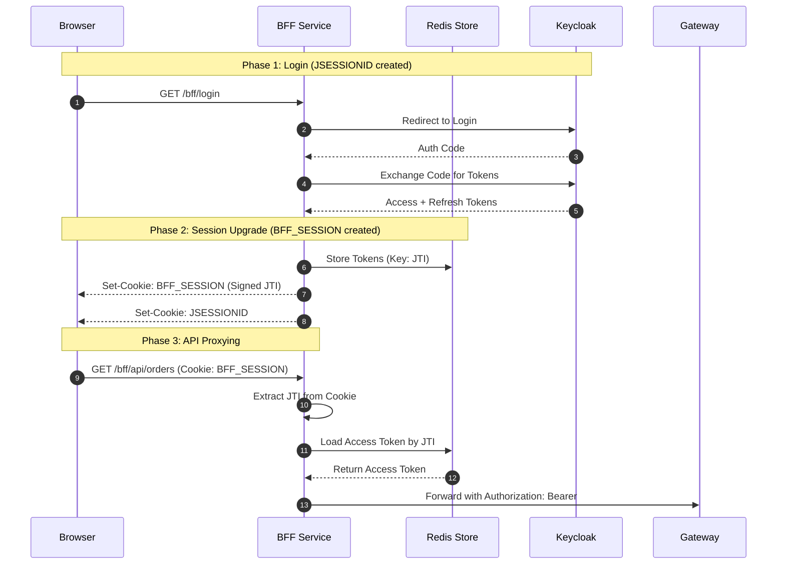

# Dual Session Strategy

This document explains the "Dual Session" architecture implemented in the Backend-for-Frontend (BFF) service to secure the Web application.

## Overview

The BFF maintains two distinct, concurrent session mechanisms. This separation balances the standard ease-of-use provided by Spring Security with the custom requirements of a distributed microservices environment.

---

## 1. Spring Security Session (`JSESSIONID`)

**Type:** Standard Servlet Session (Stateful).  
**Storage:** In-memory (can be Redis-backed).

### Purpose
The `JSESSIONID` session is used primarily for the **initial authentication flow** and **identity retrieval**.

*   **OAuth2 Orchestration:** Manages the state of the Authorization Code grant flow (redirects to Keycloak, state/nonce validation).
*   **Identity Source:** Populates the `SecurityContextHolder`. This allows the `/bff/user` endpoint to return the user's OIDC claims (name, email, roles) using standard `@AuthenticationPrincipal` injection.
*   **Scoped Access:** Limited to the BFF's internal controllers that do not proxy requests to downstream services.

---

## 2. BFF Custom Session (`BFF_SESSION`)

**Type:** Custom Opaque Token (Cookie-based JWT reference).  
**Storage:** Redis (OIDC tokens) + Browser Cookie (Signed pointer).

### Purpose
The `BFF_SESSION` is the "heavy lifter" used for **API Proxying** and **Token Lifecycle Management**.

*   **Token Abstraction:** Instead of sending the large Keycloak Access Token (JWT) to the browser, the BFF stores it in Redis and gives the browser a small, signed `BFF_SESSION` cookie containing a `jti` (unique ID).
*   **Stateless Proxying:** When a request hits `/bff/api/**`, the `TokenRefreshFilter` extracts the `jti` from the cookie, retrieves the *real* tokens from Redis, and attaches them to the outgoing request to the Gateway.
*   **Proactive Refresh:** Because the tokens are stored in Redis, the BFF can proactively refresh the Access Token using the Refresh Token *before* forwarding the request, without the browser ever knowing.

#### Storage format: `BffSession`, not `OAuth2AuthorizedClient`

Redis stores a `BffSession` Java record (`bff:session:<jti>`), not Spring Security's
`OAuth2AuthorizedClient` object:

```java
record BffSession(
    String principalName,
    String accessToken,
    Instant accessTokenExpiresAt,
    String refreshToken,
    String idToken,
    Set<String> scopes) {}
```

The record is serialized to plain JSON (Spring Data Redis 4's Jackson-3-backed
`JacksonJsonRedisSerializer`), not JDK serialization. This matters for three reasons:

*   **No client secret in Redis.** `OAuth2AuthorizedClient` embeds the whole `ClientRegistration`,
    including the OAuth2 client secret. `BffSession` never carries the registration - only the
    token values issued to that specific user - so a Redis compromise or an over-broad backup
    cannot leak the client secret.
*   **No Java deserialization surface.** JDK-deserializing a value an attacker could influence is
    a classic RCE vector. A JSON record closes that off; there is nothing to deserialize into
    arbitrary Java types.
*   **Decoupled from Spring Security's internals.** `OAuth2AuthorizedClient`'s shape isn't a
    stable serialization contract across Spring Security versions - a routine upgrade could
    silently break every session already sitting in Redis. `BffSession` is ours to own and
    version.

`TokenRefreshFilter` looks the Keycloak client id/secret/token URI up from the
`ClientRegistrationRepository` (by the `keycloak` registration id) when it needs to call the
token endpoint, instead of reading them off the (no longer present) `ClientRegistration` that used
to travel with the stored client.

The `JSESSIONID` session (see above) remains a standard Spring Session, itself backed by Redis via
`spring-session-data-redis` - it is unaffected by this change.

---

## Why use two sessions?

| Feature | JSESSIONID (Spring) | BFF_SESSION (Custom) |
| :--- | :--- | :--- |
| **Primary Goal** | Login flow & Local Identity | Distributed API Access |
| **Security** | Standard CSRF/Session Mgmt | XSS mitigation (Opaque pointer) |
| **Scale** | Tied to Servlet Container | Distributed via Redis |
| **Complexity** | Low (Auto-configured) | Medium (Manual Filter/Service) |

### The Security Synergy
1.  **XSS Protection:** Even if an attacker steals the `BFF_SESSION` cookie, they do not have the raw Keycloak Access Token. They only have a signed reference.
2.  **Instant Revocation:** By deleting the entry in Redis, the session is invalidated across the entire system instantly, even if the cookie hasn't expired.
3.  **No Token Leakage:** The browser never sees the Keycloak JWT, preventing it from being leaked via logs, history, or browser extensions.

---

## Request Flow Diagram



## Logout

`/bff/logout` is a `POST` endpoint (CSRF-protected like any other state-changing request, since
it isn't in the CSRF `ignoringRequestMatchers` list - see `SecurityConfig`). When called, the
system performs a **Full Cleanup**:
1.  **Redis:** Deletes the session data associated with the `jti`.
2.  **JSESSIONID:** Invalidate the Spring HTTP session.
3.  **Cookies:** Clears both `BFF_SESSION` and `JSESSIONID` from the browser.
4.  **SSO:** Redirects to Keycloak to invalidate the global Single Sign-On session.
