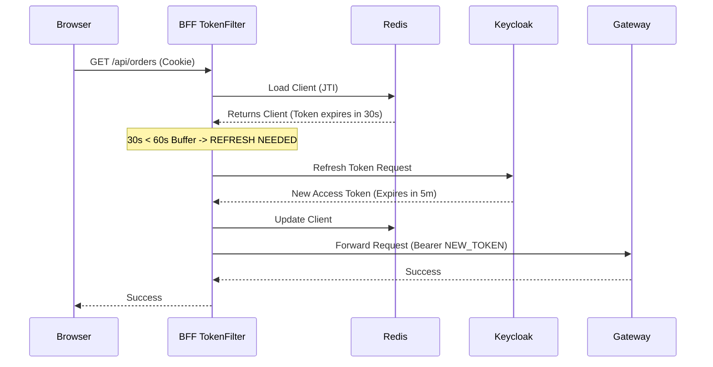

# Proactive Token Refresh (Defense in Depth)

This document describes the strategy for handling "Mid-Flight Token Expiration" in our distributed system.

## The Problem: Mid-Flight Expiration

In a Defense in Depth architecture using JWKS, every microservice validates the Access Token.

1.  **Gateway** receives request. Token expires in **2 seconds**. Gateway validates: **OK**.
2.  Gateway forwards to **Order Service**. Network latency + processing takes **3 seconds**.
3.  **Order Service** receives request. Token is now **expired**. Order Service validates: **FAIL (401)**.

The user's request fails even though they were valid when they started.

## The Solution: Proactive Refresh with Time Buffer

We implement a **Safe Buffer** (e.g., 60 seconds). If a token is valid but has less than 60 seconds of life remaining, we treat it as "expired" for the purpose of starting a new transaction, and we refresh it **before** sending the request to the backend.

## Implementation Guide

The responsibility lies with the component holding the **Refresh Token**.

### 1. Web Application (BFF Pattern)

The BFF holds the Refresh Token in its session store (Redis).

*   **Mechanism:** A Servlet Filter (or Pre-Request Logic).
*   **Trigger:** On every incoming request to a secured API (`/api/**`).
*   **Logic:**
    1.  Extract the Session ID (JTI) from the `HttpOnly` cookie.
    2.  Load the `OAuth2AuthorizedClient` from Redis.
    3.  Check `Access Token Expiration`.
    4.  **Condition:** `if (Expiration - Now) < 60 seconds`:
        *   Execute **Refresh Token Grant** with Keycloak.
        *   Update the `OAuth2AuthorizedClient` with the new Access/Refresh tokens.
        *   Save back to Redis.
    5.  Proceed with the request using the (potentially new) Access Token.

### Race-Safe Refresh (Refresh Token Rotation)

The realm has refresh token rotation enabled (`revokeRefreshToken=true`,
`refreshTokenMaxReuse=0`): every refresh call returns a brand new refresh token, and the old one
can never be used again. That is a problem if two requests for the same session both see an
expiring access token at nearly the same time - without protection, both would call Keycloak with
the same (old) refresh token, and the loser would be rejected with `invalid_grant`.

`TokenRefreshFilter` avoids this with a short-lived Redis lock (`RefreshLockService`), one key per
session: `bff:session:<jti>:refresh-lock`, set with `NX` (only if absent) and a ~5 second expiry.

*   The request that acquires the lock does the actual refresh, saves the new tokens, then
    releases the lock.
*   Any other request for the same `jti` that arrives while the lock is held does **not** refresh
    - it polls every ~50ms (up to ~3 seconds) until the lock disappears, then reloads the session
    from Redis and carries on with whatever the lock holder left there: fresh tokens on success,
    or nothing if the refresh failed and the session was deleted (treated as unauthenticated,
    same as today).
*   The lock's own expiry is a safety net, not the primary correctness mechanism: if a refresh
    call is unusually slow and the lock expires mid-call, and Keycloak then rejects it as
    `invalid_grant` because another node already rotated the token first, the filter reloads the
    session before deleting it - if it already changed, another node's fresh tokens are kept
    instead of being wiped out by a slower, now-stale failure.

This works across multiple BFF instances, not just multiple threads in one process, because the
lock lives in the shared Redis, not in memory.

### 2. Mobile Application

The Mobile App holds the Refresh Token in secure storage (Keychain/Keystore).

*   **Mechanism:** HTTP Client Interceptor (Retrofit, Axios, Alamofire).
*   **Trigger:** Before every network request.
*   **Logic:**
    1.  Check local Access Token `exp` claim.
    2.  **Condition:** `if (Expiration - Now) < 60 seconds`:
        *   Call Keycloak Token Endpoint (`grant_type=refresh_token`).
        *   Save new tokens to secure storage.
    3.  Attach the valid Access Token to the header.
    4.  Execute the API request.

## Sequence Diagram (BFF Example)

